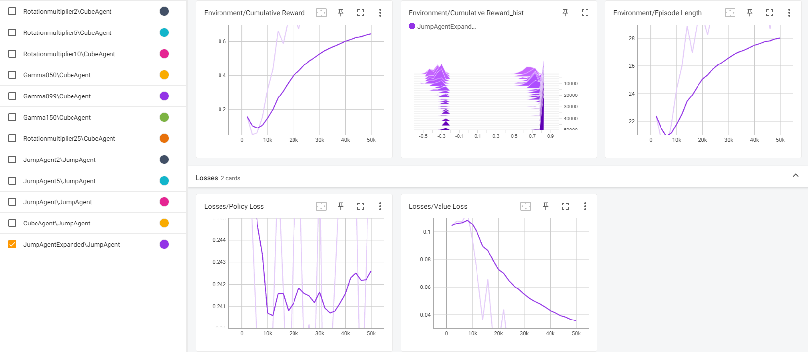

Alae Chatar Philippe Mazur
# Jumper tutorial        

## Maak een omgeving waarmee de agent kan interageren:
          1. Start van een lege scene 
          2. Voeg een Plane toe en noem deze Floor met:  Position = (0, 0, 0), Rotation = (0, 0, 0), Scale = (3, 1, 1) 
          3. Voeg een Cube toe en noem deze Obstacle met: Position = (3, 0.5, 3), Rotation = (0, 0, 0), Scale = (1, 1, 4)
          4. Voeg een Cube toe en noem deze Agent met: Position = (0, 0.5, 0), Rotation = (0, 0, 0), Scale = (1, 1, 1)
          5. Voeg de Rigidbody component toe bij de Agent en Obstacle
          6. Voeg een leeg GameObject, noem het TrainingArea met: Position = (0, 0, 0), Rotation = (0, 0, 0), Scale = (1, 1, 1) 
          7. Voeg Cubes toe die als muren dienen achter Agent aan de uiteinde van de floor en aan bijde randen, zet vervolgens ook de mesh renderer uit
          8. Sleep alles in TrainingArea. 
          9. Gebruik materialen om de objecten een kleurtje te geven

## Implementeer volgende scripts voor je objecten:
          - Agent:
              using System.Collections;
              using System.Collections.Generic;
              using Unity.MLAgents;
              using Unity.MLAgents.Actuators;
              using Unity.MLAgents.Sensors;
              using UnityEngine;

              public class JumpCubeAgent : Agent
              {
                  public float Force = 15f;
                  private Rigidbody rb = null;
                  private Vector3 originalPosition = new Vector3(23.68312f, 0.5f, -0.004343987f);
                  private bool isJumping = false;
                  private GameObject obstacle = null;

                  public override void Initialize()
                  {
                      rb = this.GetComponent<Rigidbody>();
                      rb.constraints = RigidbodyConstraints.FreezeRotation | RigidbodyConstraints.FreezePositionX | RigidbodyConstraints.FreezePositionZ;
                      obstacle = GameObject.Find("Obstacle");

                  }

                  public override void OnActionReceived(ActionBuffers actionBuffers)
                  { 

                     if(actionBuffers.DiscreteActions[0] == 1)
                      {
                          Thrust();
                      }
                  }

                  public override void CollectObservations(VectorSensor sensor)
                  {
                      // Agent positie   
                      sensor.AddObservation(this.transform.localPosition);
                      sensor.AddObservation(this.obstacle.transform.localPosition);
                  }

                  public override void OnEpisodeBegin()
                  {
                      ResetPlayer();
                      isJumping = false;
                  }

                  public override void Heuristic(in ActionBuffers actionsOut)
                  {
                      var discreteActionsOut = actionsOut.DiscreteActions;
                      discreteActionsOut[0] = 0;
                      if (Input.GetKey(KeyCode.UpArrow))
                      {
                          discreteActionsOut[0] = 1;
                      }

                  }

                  private void Thrust()
                  {
                      if(transform.position.y <= 0.5f)
                      {
                          rb.AddForce(Vector3.up * Force, ForceMode.Acceleration);
                          AddReward(-0.05f);
                      }

                  }

                  private void OnCollisionEnter(Collision collision)
                  {
                      if (collision.gameObject.CompareTag("obstacle"))
                      {
                          collision.gameObject.transform.position = new Vector3(11, 0.3603692f, 0.002144069f);
                          AddReward(-0.25f);
                          EndEpisode();
                      }
                  }

                  private void ResetPlayer()
                  {
                      //this.transform.position = originalPosition;
                  }
              }
________________________________________________________________________________________
            
            - Obstacle:
                using UnityEngine;
                using Unity.MLAgents;

                public class Obstacle : MonoBehaviour
                {
                    public float moveSpeed = 10f;
                    public GameObject player;
                    private bool flip;

                    // Update is called once per frame
                    void Update()
                    {
                        Debug.Log(this.transform.position.z);
                        this.transform.Translate(Vector3.right * moveSpeed * Time.deltaTime);

                        if (flip == false)
                            this.transform.Translate(-Vector3.forward * (moveSpeed + 5) * Time.deltaTime);
                        else
                            this.transform.Translate(Vector3.forward * (moveSpeed + 5) * Time.deltaTime);
                    }

                    private void OnCollisionEnter(Collision collision)
                    {
                        if(collision.gameObject.CompareTag("wall"))
                        {
                            this.gameObject.transform.position = new Vector3(11, 0.3603692f, 0.002144069f);
                            player.GetComponent<Agent>().AddReward(0.9f);
                            player.GetComponent<Agent>().EndEpisode();
                        }

                        if (collision.gameObject.CompareTag("flip"))
                            flip = true;
                        if (collision.gameObject.CompareTag("flip2"))
                            flip = false;
                    }
                }
_____________________________________________________________________________________________

## Trainen van de agent:
	- Train de agent door deze commando te runnen in anaconda: mlagents-learn config/CubeAgent.yaml --run-id=CubeAgent --force
	- Gebruik Tensorboard om het trainen op te volgen door deze commando te runnen in anaconda: tensorboard --logdir results

## Resultaten

